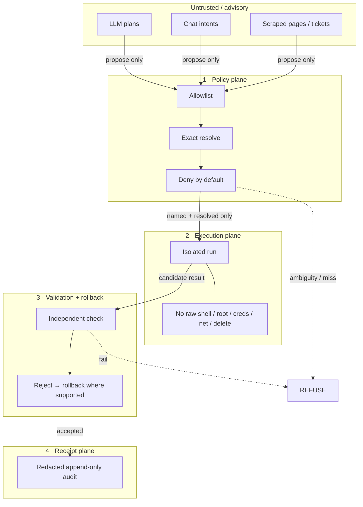

# Hermes Controlled Execution

Fail-closed macOS execution layer for agent-driven work.

**Status:** Early public scaffold (Apache-2.0). This document describes intended architecture and boundaries. Implementation on `main` is landing; do not assume production readiness.

**Affiliation:** Technical artifact under **Memory Utility Labs** (lab-first public face). Product context: intended for the AEGIS / AION stack.  
**Not affiliated with:** Quantify Labs’ Aegis Memory.

---

## 1. Problem

Agents and automations that can act on a real Mac create a high-blast-radius control plane. A single ambiguous path, over-broad shell grant, or silent success without audit turns “helpful automation” into uncontrolled system change.

Hermes exists to make execution **narrow, inspectable, and fail-closed**.

---

## 2. Threat model

### Assets

| Asset | Why it matters |
|---|---|
| Host filesystem integrity | Automation must not silently rewrite or delete critical state |
| Credentials & secrets | Must never be readable or exfiltratable via execution path |
| Network identity | Must not open unconstrained egress under agent control |
| Privilege boundary | Root / TCC / SIP-adjacent power must stay human-gated |
| Auditability | After-the-fact reconstruction of what ran, on what, with what result |

### Adversaries / failure modes (design against)

1. **Over-broad agent intent** — model asks for “clean up” / “fix it” without a named, resolvable target.
2. **Ambiguous resolution** — path, app, or resource resolves to more than one candidate.
3. **Privilege escalation** — request implies root, credential access, or unrestricted shell.
4. **Silent mutation** — work appears to succeed with no receipt or with redaction failures that hide what changed.
5. **Replay / double-apply** — same action applied twice causes compounding damage.
6. **Confused deputy** — Automator or other front end used to bypass allowlist policy.
7. **Supply-chain / prompt injection** — untrusted content tries to coerce forbidden capabilities.

### Out of threat-model (for now)

- Full malware analysis of third-party binaries Hermes might invoke (future hardening).
- Guarantees against a human operator who already has admin and chooses to bypass Hermes.
- Cross-host orchestration or remote C2.

---

## 3. Trust boundaries



**Rule:** Nothing crosses a boundary unless the previous plane accepted it. Ambiguity or missing policy ⇒ **refuse**.

---

## 4. Capability model

### Allowed shape (design intent)

Operations that are:

- **Named** on an allowlist
- **Exactly resolved** to one target
- **Isolated** in execution
- **Independently validated**
- **Idempotent** where mutation is involved
- **Receipted** (redacted, append-only)

Optional human front end (Automator) must inherit the **same** policy — it is not a back door.

### Explicitly denied

| Denied | Rationale |
|---|---|
| Unrestricted shell | Infinite blast radius |
| Root / privilege escalation | Breaks host trust boundary |
| Credential read / use | Secrets must not enter agent path |
| Unconstrained network | Exfil + remote control risk |
| Deletion authority | Irreversible damage without separate, explicit policy |

---

## 5. Control loop

```
Intent → Allowlist match? → Exact resolve? → Isolated execute
      → Validate → (fail: rollback / refuse) → Append redacted receipt
```

| Stage | Fail-closed behavior |
|---|---|
| Allowlist miss | Refuse |
| Non-exact resolve | Refuse |
| Isolation unavailable | Refuse |
| Validation fail | Rollback if supported; never “accept anyway” |
| Receipt write fail | Treat as failure (no silent success) |

---

## 6. Non-goals

- General-purpose remote administration
- Memory-as-a-service product API (lab research ≠ this repo)
- Claiming AEGIS is production-complete
- Competing with or implying identity as Quantify Labs’ Aegis Memory

---

## 7. Evidence labels

| Claim | Label |
|---|---|
| Public repo + Apache-2.0 | **Verified** |
| Fail-closed / allowlist / isolation / validation / rollback / receipts / Automator front end | **Documented design intent** (repo description) |
| Complete implementation on `main` | **Landing / not assumed** |
| Production deployment | **Not claimed** |

---

## 8. Repository status

Expect a thin tree while implementation lands. License and this architecture note are the public contract until modules appear under explicit paths.

```
Hermes-Controlled-Execution/
├── LICENSE
├── README.md
└── (implementation landing)
```

---

## License

Apache License 2.0 — see [`LICENSE`](./LICENSE).
